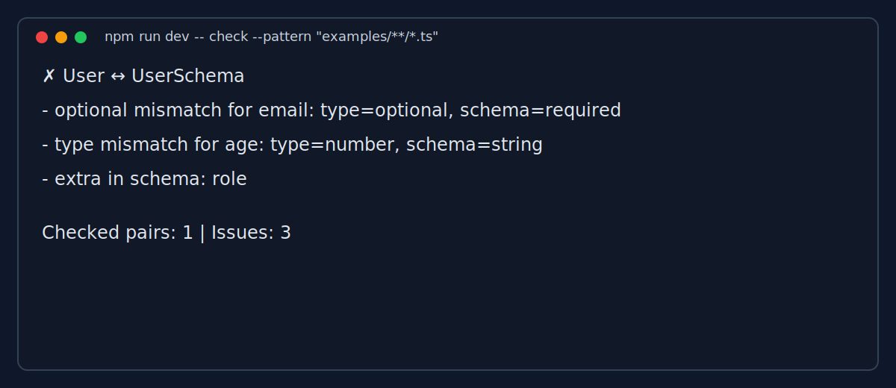

# zodrift

[](https://www.npmjs.com/package/zodrift)
[](https://github.com/greyllmmoder/zodrift/actions/workflows/ci.yml)
[](https://opensource.org/licenses/MIT)

Catch drift between your TypeScript types and Zod schemas.

```ts
import { z } from "zod";

export interface User {
  name: string;
  email?: string;
  age: number;
}

export const UserSchema = z.object({
  name: z.string(),
  email: z.string(),
  age: z.string(),
  role: z.string(),
});
```

```bash
npx zodrift check
```



What it catches:
- missing fields
- extra fields
- required vs optional mismatch
- basic type mismatch

Roadmap:
- nested support
- arrays
- unions
- JSON output
- GitHub Action
